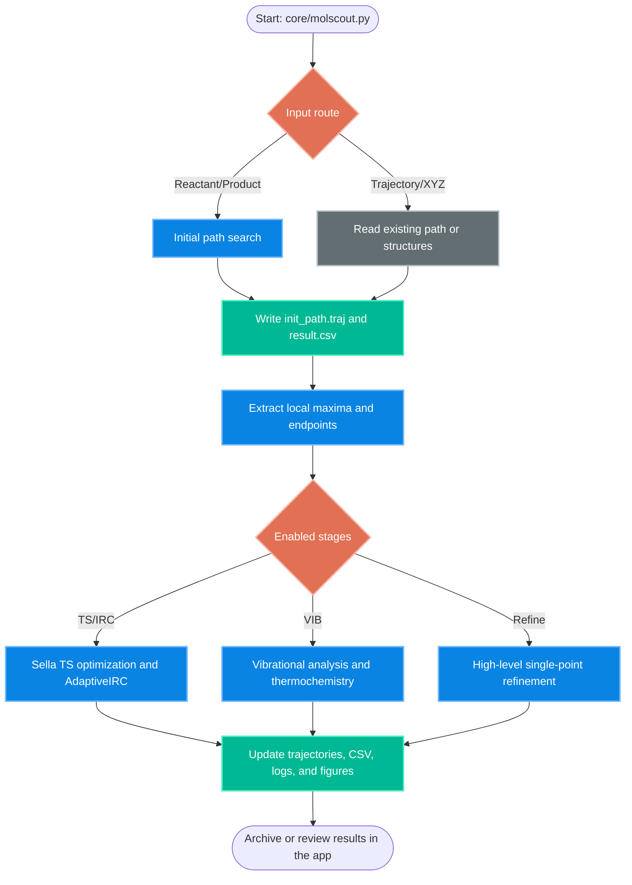

# Architecture Overview: MolScout

## 1. Repository structure

MolScout keeps the shared user interface separate from the scientific workflow code.

- `app/` contains the Streamlit UI, queue management, session storage, worker control, monitoring, cleanup, and archive utilities.
- `core/` contains the calculation workflow, calculator definitions, trajectory utilities, plotting helpers, PySCF export routines, configuration defaults, and bundled sample structures.
- `docs/` contains notes on architecture, workflow behavior, calculator backends, and environment setup.

The earlier `fircm/` directory has been replaced by `core/`. Standalone variant scripts that duplicated the main workflow have been removed; the application wrapper now sets workflow flags and launches the single maintained entry point, `core/molscout.py`.

## 2. Data-flow model

MolScout uses a file-based handoff model. Instead of passing long-lived in-memory objects directly between stages, each stage communicates through standard files such as `.traj`, `.xyz`, `.csv`, `.json`, `.molden`, figures, and logs.

This design has several advantages.

- Intermediate files can be inspected, restarted, and reviewed manually.
- If a downstream stage fails, already generated path, TS, IRC, and VIB outputs remain reusable.
- The Streamlit app can archive and display job results without depending on internal Python object state.

## 3. Central configuration

`core/default_config.py` defines default workflow flags, numerical thresholds, calculator choices, logging names, and output names. The Streamlit wrapper loads this module and applies per-job overrides before running `core/molscout.py`.

This keeps the source tree stable while allowing each queued job to select stages such as initial path search, TS optimization, IRC, VIB, figure refresh, and refinement.

## 4. Core workflow entry point

`core/molscout.py` is the single maintained workflow entry point. It can run the full reactant/product workflow directly, and it also accepts app-managed settings for stage-specific jobs. This avoids maintaining separate script copies for IRC-only, VIB-only, and figure-refresh modes.

## 5. Logging and traceability

Each run records operational messages and configuration values in `molscout.log` inside the job output directory. The app also stores process stdout, queue metadata, runtime status, and validation results in each job directory.

The result CSV is the main tabular output. Additional outputs such as trajectory splits, figures, JSON exports, and Molden files are generated when the corresponding stage and backend are enabled.

## 6. High-level workflow

