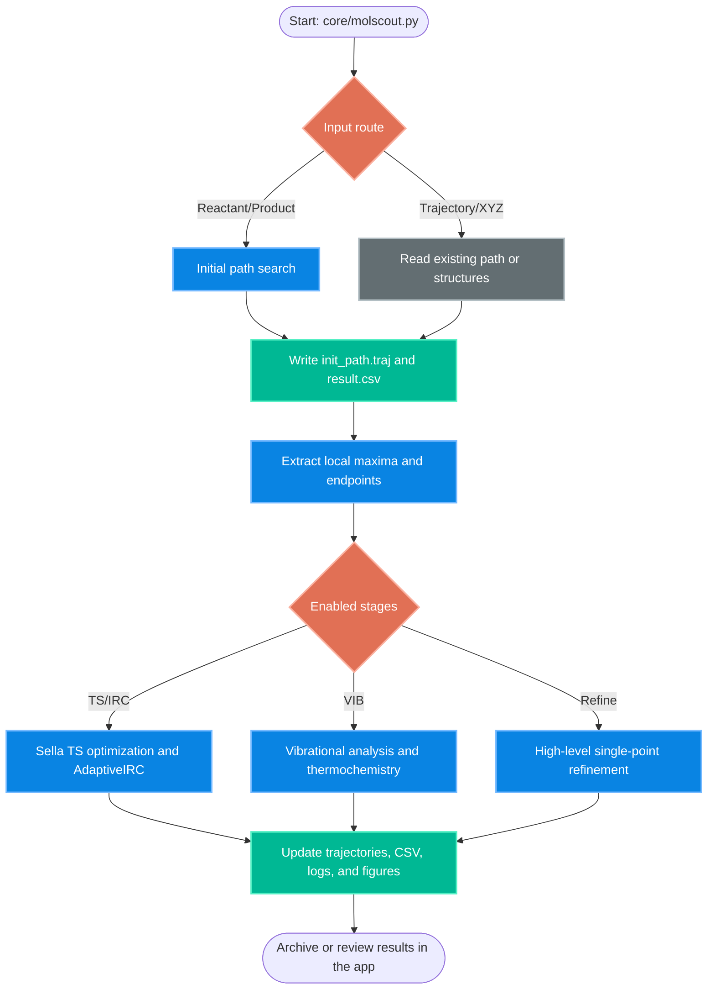

# Architecture Overview: MolScout

[English](../01_architecture.md)

## 1. Repository structure

MolScout は、共有 user interface と科学計算 workflow code を分離して管理します。

- `app/` は Streamlit UI、PostgreSQL-backed queue/session metadata、worker control、monitoring、archive utilities を含みます。
- `core/` は calculation workflow、calculator definitions、trajectory utilities、plotting helpers、PySCF export routines、configuration defaults、bundled sample structures を含みます。
- `docs/` は architecture、workflow、backend、environment に関する notes を含みます。

従来の `fircm/` directory は `core/` に置き換えています。main workflow と重複していた standalone variant scripts は削除し、application wrapper が workflow flags を設定して単一の entry point である `core/molscout.py` を起動します。

## 2. Data-flow model

MolScout は metadata と calculation files を分離した hybrid persistence model を採用します。session、job、shared queue、application state は PostgreSQL に保存し、各 calculation stage は `.traj`、`.xyz`、`.csv`、`.json`、`.molden`、figures、logs などの標準 file を介して連携します。これらの実体ファイルは project root の `data/` 以下に保持します。

検索価値の高い成果物については、file content を移動せず、`data/` からの relative path、file type、role、size、modified time、manifest 由来情報だけを PostgreSQL の artifact catalog に登録します。既存 file は再スキャン可能で、新規 job は terminal state への遷移時に自動登録されます。

この設計には、以下の利点があります。

- intermediate files を inspection、restart、manual review に利用できます。
- downstream stage が失敗しても、既に得られた path、TS、IRC、VIB の出力を再利用しやすくなります。
- Streamlit app は内部 Python object state に依存せず、job results を archive・表示できます。

## 3. Central configuration

`core/default_config.py` は、default workflow flags、numerical thresholds、calculator choices、logging names、output names を定義します。Streamlit wrapper はこの module を読み込み、`core/molscout.py` の実行前に job ごとの override を適用します。

これにより source tree を安定に保ちながら、queued job ごとに initial path search、TS optimization、IRC、VIB、figure refresh、refinement などの stage を選択できます。

## 4. Core workflow entry point

`core/molscout.py` は、保守対象の単一 workflow entry point です。reactant/product を用いる full workflow を直接実行でき、stage-specific job については app-managed settings を受け取って実行します。これにより、IRC-only、VIB-only、figure-refresh mode ごとに script copy を維持する必要がありません。

## 5. Logging and traceability

各 run は、operational messages と configuration values を job output directory 内の `molscout.log` に記録します。app 側では process stdout、runtime status、validation results を各 job directory に保存し、queue と job の管理 metadata は PostgreSQL に保存します。

result CSV は主要な tabular output です。trajectory split、figures、JSON exports、Molden files などの追加 output は、対応する stage と backend が有効な場合に生成されます。

## 6. High-level workflow

